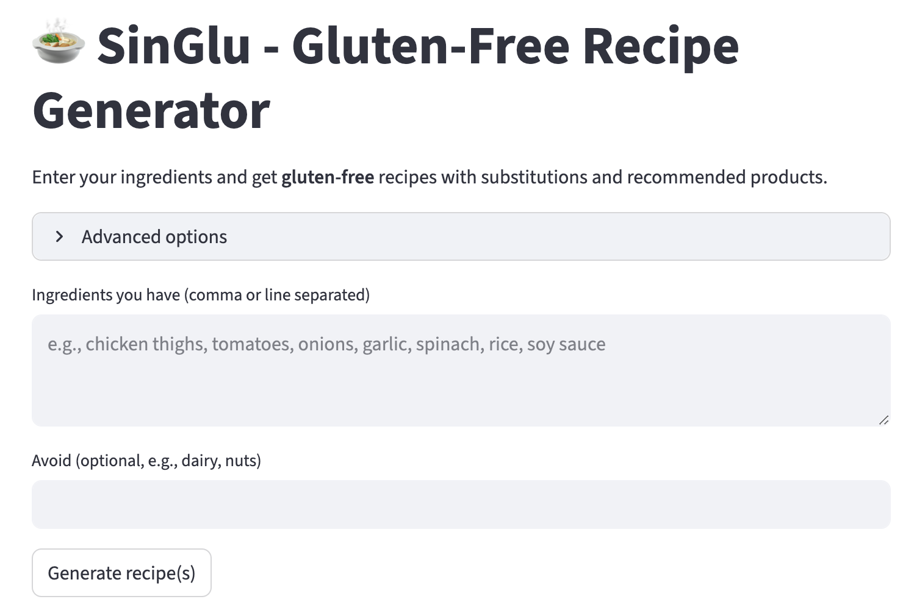
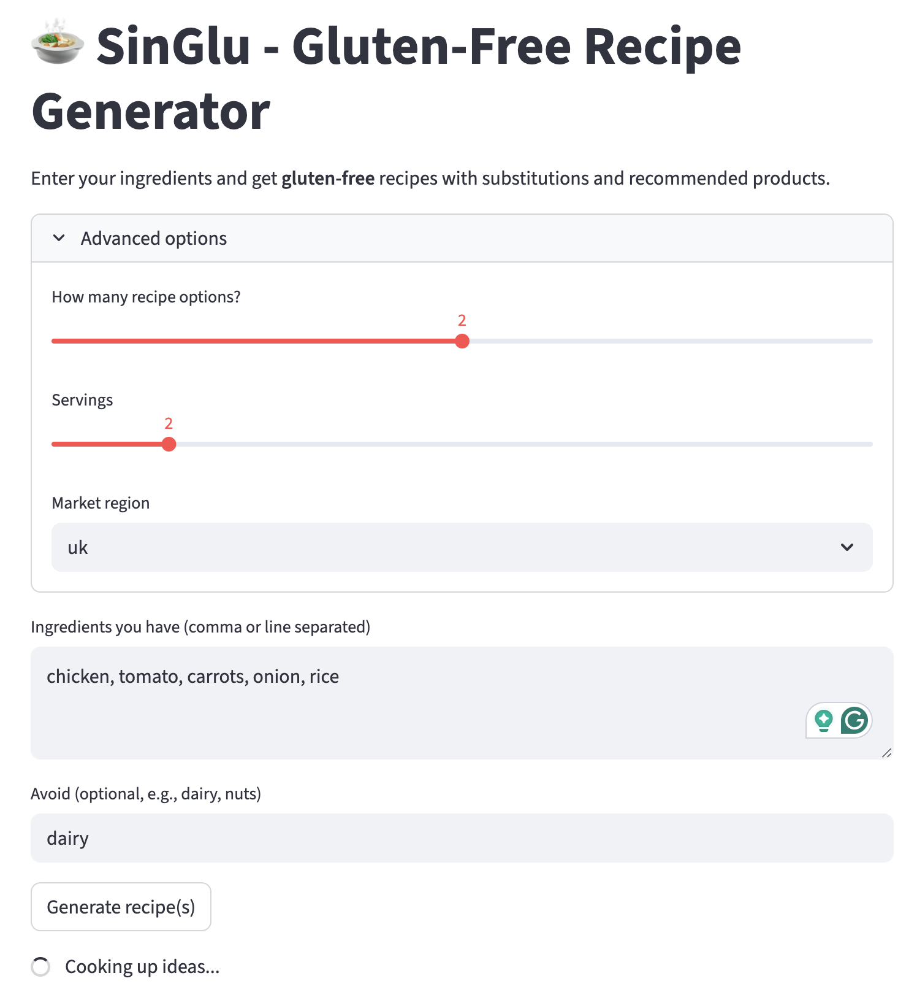
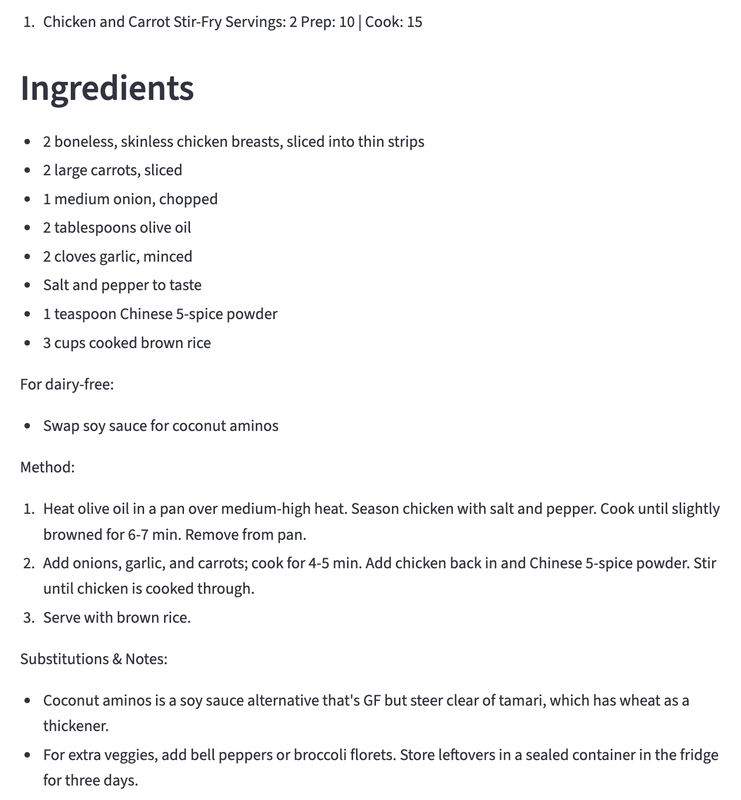
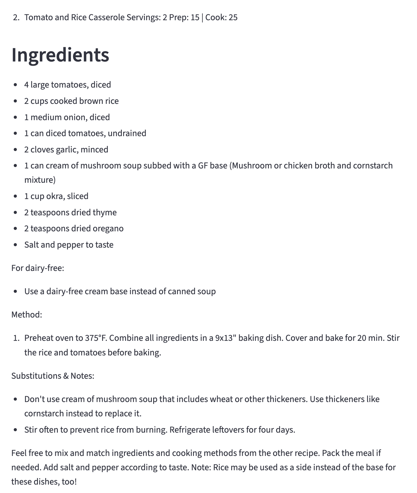

# SinGlu – Gluten-Free Recipe Generator 🍲

<div style="display: flex; flex-wrap: wrap; align-items: center; gap: 20px;">

<div style="flex: 1; min-width: 300px;">
<p>
<b>SinGlu</b> is an AI-powered application that generates <b>gluten-free recipes</b> from your available ingredients using state-of-the-art Hugging Face models. The app provides smart ingredient substitutions to ensure safe and delicious gluten-free meals.
</p>
</div>

<div style="flex: 1; min-width: 300px; text-align: center;">

</div>

</div>

---

## Features
- AI-powered gluten-free recipe generation
- Detection of common gluten ingredients with smart substitutions
- Hugging Face chat completion API (default model: `HuggingFaceH4/zephyr-7b-beta:featherless-ai`)
- Web interface built with Streamlit
- Product recommendations for gluten-free alternatives
- Support for multiple regions (currently UK 🇬🇧 and Spain 🇪🇸)

---

## Live Demo
The app is hosted on Streamlit Cloud and can be accessed here: [**Open SinGlu**](https://your-app-link.streamlit.app)

---

## Tech Stack
- **Python 3.10+** – Core programming language  
- **Streamlit** – Web interface for interactive recipe generation  
- **Hugging Face Inference API** – Large language model integration (`zephyr-7b-beta`)  
- **Requests** – API communication  
- **GitHub + Streamlit Cloud** – Version control and deployment
- **JSON config** – for product links

---

## Product Recommendations
SinGlu enhances the recipe experience by suggesting gluten-free product alternatives (e.g., pasta, soy sauce).  

- Users can **choose their region** (UK 🇬🇧 or Spain 🇪🇸) via the app.  
- Product links are stored in a separate `product_links.json` file.  
- Links can be configured to include tracking parameters if needed.  

Example usage:
- If a recipe calls for **gluten-free pasta**, SinGlu shows a product link to Amazon UK or Spain.

---

## Example

## Example

| Ingredient Input Screen | Generated Recipe 1 | Generated Recipe 2 |
|--------------------------|----------------------|----------------------|
|  |  |  |

---

## Notes for Users
- Free-tier models may have occasional delays or rate limits; the app automatically handles retries.
- Always verify allergen safety for packaged ingredients. Look for certified gluten-free labels when preparing meals.

---

## References
- [Hugging Face Inference API](https://huggingface.co/docs/api-inference/index)  
- [Streamlit Documentation](https://docs.streamlit.io/)  
- [Zephyr-7B-Beta Model Card](https://huggingface.co/HuggingFaceH4/zephyr-7b-beta)  

---

## License (MIT)
```text
MIT License

Copyright (c) 2025 Ines Ruiz

Permission is hereby granted, free of charge, to any person obtaining a copy
of this software and associated documentation files (the "Software"), to deal
in the Software without restriction...
```

